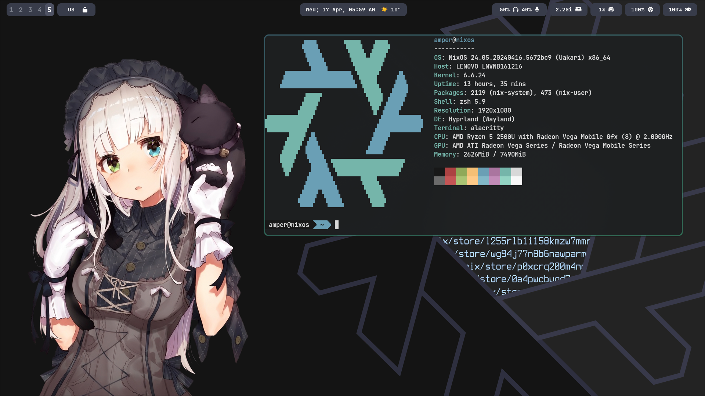

# ❄️ My NixOS Config

This configuration is based on [&'s config](https://github.com/Andrey0189/nixos-config)

## Users
- [Sweetbread](./user/sweetbread)
- [Chest](./user/chest)

## Hosts
- [Rias](./host/Rias)
- [Senko](./host/Senko)
- [Eclipse](./host/Eclipse)
- [Impreza](./host/Impreza)

## How does this work?
The [flake](./flake.nix) file is the starting point. While installing/rebuilding
the correct `host` is chosen, which includes `./host/${host}/configuration.nix`.

It includes 2 (actually, more, but hey!) files:
- [`./host/modules/common.nix`](./host/modules/common.nix): Common setting
for all hosts (I don't say)
- [`./user/common.nix`](./user/common.nix): Common settings for all users (you
got the idea) and setup of [home-manager](https://github.com/nix-community/home-manager)

It allows me to remove duplications and add multiple users to one host

Example with Rias:
```
./host/Rias/configuration.nix
  ./host/Rias/modules/*
  ./host/modules/gpu/nvidia.nix
  ./host/modules/common.nix
    ./host/Rias/hardware-configuration.nix
    ./modules/host.nix
      ./modules/host/*
    ./host/modules/packages.nix
  ./user/common.nix
    ./user/sweetbread/home.nix
      ./user/sweetbread/modules/*
    ./modules/user.nix
      ./modules/user/*
```

## Programs
Most of programs are defined in [user modules](./modules/user)


